<h3 align=“center”>
<b>Praktikum Kemanan Jaringan</b> 
Broken Access Control (OWASP 10 Juice Shop)
</h3>
 

 

Dosen Pembimbing: 
Ferry Astika Saputra, S.T., M.Sc.

 

Disusun Oleh: 
Iqbal Darmawan (3122640041)

 

<b>
KELAS D4 LJ IT B  
JURUSAN D4 LJ TEKNIK INFORMATIKA  
DEPARTEMEN TEKNIK INFORMATIKA DAN KOMPUTER  
POLITEKNIK ELEKTRONIKA NEGERI SURABAYA  
2023
</b>

 

1. Five-Star Feedback

Merubah data customer feedback melalui admin.

1. Login sebagai admin terlebih dahulu
1. Masuk ke laman /administration

1. Hapus customer feedback dengan bintang 5

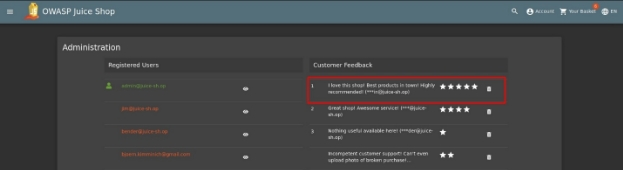

1. Forged Feedback

Merubah data nilai feed back produk dengan nilai custom

1. Pertama memasukkan feedback baru

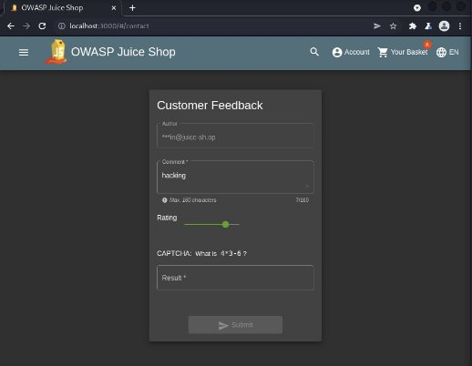

1. Lalu buka aplikasi burp suite dan nyalakan intercept on ketika akan melakukan submit forged feedback dan ubah data userid dengan userid lainnya

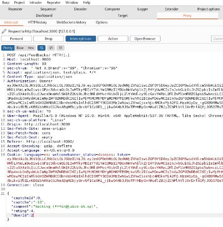

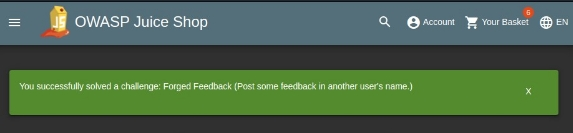

1. Forged Review

Forged review ini akan melakukan manipulasi data review produk.

1. Pertama login terlebih dahulu
1. Lalu tambahkan review pada produk

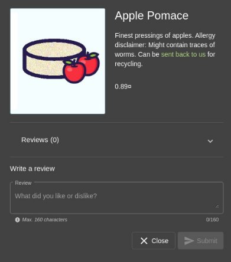

1. Buka burp suite lalu check endpoint terakhir pada HTTP History dengan method PUT dan kirim ke repeater dan ubah datanya dan kirimkan lagi bodynya melalui burpsuite

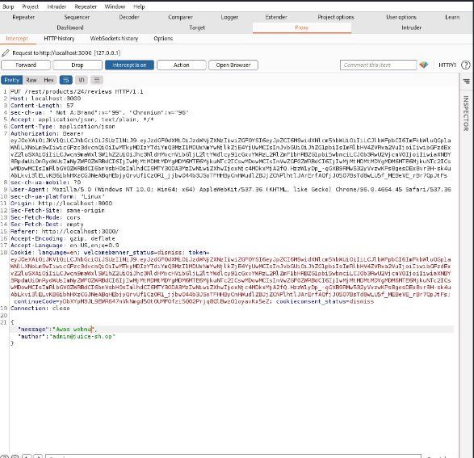

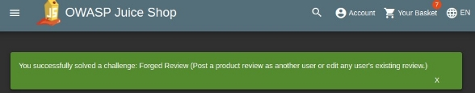

1. Manipulate Basket

Pada proses ini akan memanipulasi data keranjang

1. Lakukan register akun baru
1. Jika sudah login akun baru tambahkan produk ke keranjang

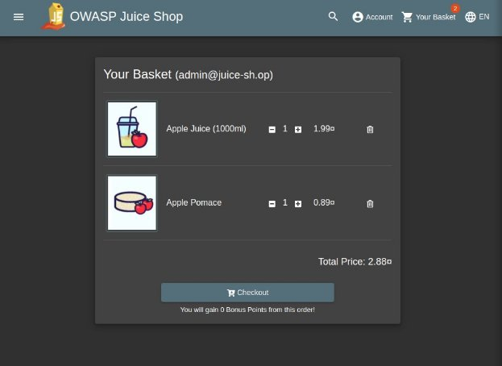

1. Buka burp suite dan check endpoint terakhir untuk mengupdate keranjang lalu kirim ke repeater

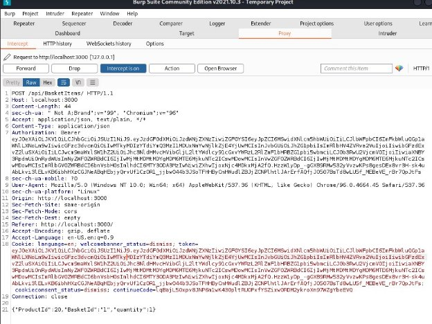

1. Ubah basketid nya agar produk masuk ke keranjang user lain

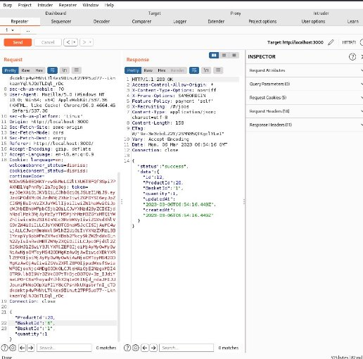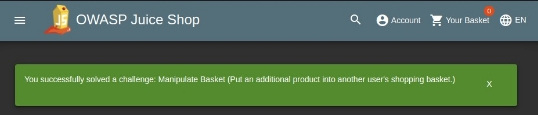
