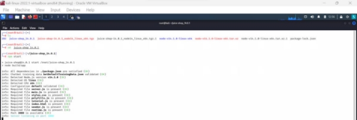
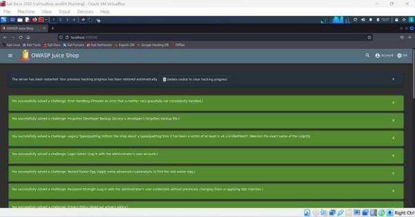
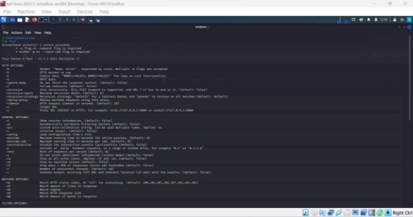
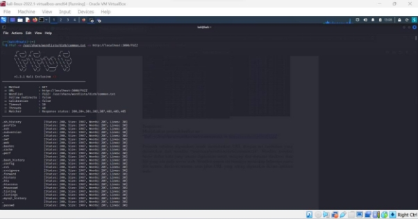
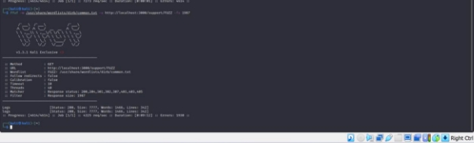
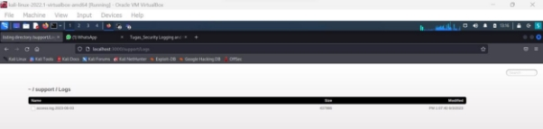
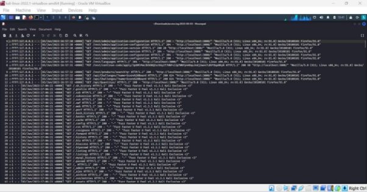

<h3 align="center">
    <b>Kemanan Jaringan</b> 
    Security Logging And Monitoring Failures
</h3>
 

  

 

    Dosen Pembimbing: 
    Ferry Astika Saputra, S.T., M.Sc.

 

    Disusun Oleh: 
    Iqbal Darmawan (3122640041)

 

    <b>
        KELAS D4 LJ IT B  
        JURUSAN D4 LJ TEKNIK INFORMATIKA  
        DEPARTEMEN TEKNIK INFORMATIKA DAN KOMPUTER   
        POLITEKNIK ELEKTRONIKA NEGERI SURABAYA  
        2023
    </b>

 
 

**Security Logging and Monitoring Failures** 

Membantu dalam mendeteksi, mengeskalasi, dan menanggapi pelanggaran aktif. Tanpa pencatatan (logging) dan  pemantauan (monitoring), pelanggaran tidak dapat dideteksi. Pencatatan deteksi harusnya dapat terjadi saat :  

- Login berulang kali yang gagal  
- Peringatan dan kesalahan akan menghasilkan pesan log yang tidak memadai  
- Peringatan dan respons yang tidak ada Berikut merupakan daftar klasifikasi CWE pada kategori A9 ini :  
- CWE-117 Improper Output Neutralization for Logs Memungkinkan penyerang memalsukan entri log atau konten berbahaya ke dalam log. Terjadi ketika :  
1. Data memasuki aplikasi dari sumber yang tidak terpercaya  
1. Data ditulis ke file log aplikasi atau sistem  
- CWE-223 Omission of Security-relevant Information Aplikasi tidak merekam atau menampilkan informasi yang penting untuk mengidentifikasi sumber atau sifat serangan atau menentukan apakah suatu Tindakan tidak aman.  
- CWE-532 Insertion of Sensitive Information into Log File  
1. Informasi yang ditulis ke file log dapat bersifat sensitive dan memberikan panduan berharga bagi penyerang atau mengekspos informasi pengguna yang sensitive  
1. Meskipun  mencatat  semua  informasi  mungkin  berguna  selama  tahap pengembangan, penting agar tingkat pencatatan diatur dengan tepat sebelum produk dikirimkan sehingga data pengguna yang sensitive dan informasi sistem tidak terpapar ke penyerang.  
- CWE-778 Insufficient Logging  
1. Perangkat tidak merekam peristiwa tersebut atau menghilangkan detail penting tentang peristiwa tersebut saat mencatatnya  
1. Peristiwa penting keamanan tidak dicatat dengan benar, seperti Upaya login yang gagal berkali-kali.  

Percobaan 

1. Start website juiceshop dengan menggunakan npm start 

2. Menggunakan FFUF untuk melakukan fuzzing pada aplikasi web 

3. Menjalankan  perintah  berikut  ini  :  “ffuf  -w /usr/share/wordlists/dirb/common.txt  -u [ http://localhost:3000/FUZZ](http://localhost:3000/FUZZ)”  untuk menjalankan  URL  dengan  url  tambahan  yang  diambilkan  dari  wordlist “usr/share/wordlists/dirb/common.txt”. Wordlist tersebut berisi daftar kata yang umum digunakan untuk menguji dan mencari direktori atau file yang ada pada server web. Wordlist umum ini biasanya mencakup beberapa nama file umum, direktori umum, atau jalur URL yang sering digunakan dalam aplikasi web. 

4. Menambahkan  perintah  ffuf  -w  /usr/share/wordlists/dirb/common.txt  -u http://localhost:3000/support/FUZZ -fs 1987 

5. Mendapatkan file acces log yang bersifat rahasia dari website 

