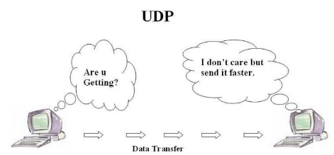

<h3 align="center">
    <b>Kemanan Jaringan</b> 
    HTTP Over UDP QUIC
</h3>
 

  

 

    Dosen Pembimbing: 
    Ferry Astika Saputra, S.T., M.Sc.

 

    Disusun Oleh: 
    Iqbal Darmawan (3122640041)

 

    <b>
        KELAS D4 LJ IT B  
        JURUSAN D4 LJ TEKNIK INFORMATIKA  
        DEPARTEMEN TEKNIK INFORMATIKA DAN KOMPUTER   
        POLITEKNIK ELEKTRONIKA NEGERI SURABAYA  
        2023
    </b>

 
 

**HTTP Over UDP / QUIC** 

**Pengertian** 

HTTP/3 adalah versi ketiga dari HTTP. Nah, Anda tahu bahwa HTTP adalah salah satu bagian penting dari dunia internet yang memungkinkan adanya pengiriman data dari satu komputer ke perangkat lainnya. Sementara, HTTPS adalah protokol HTTP versi lebih aman. 

Selama ini, HTTP/3 adalah sebuah rancangan standar internet yang dikenal sebagai HTTP- over-QUIC. Istilah QUIC sendiri merupakan akronim dari quick UDP (user datagram protocol) internet connection, penerus HTTP/2 yang dikembangkan oleh Google. 

Dengan kata lain, pengadopsian UDP sebagai protokol transfer data pada HTTP/3 menggantikan teknologi transmission control protocol (TCP) yang telah digunakan sejak versi HTTP pertama. 

Sebelum draf rancangan tersebut habis masa berlakunya,  pada 27 Juli lalu, HTTP/3 telah berada pada fase terakhir sebelum tahap request-for-comments (RFC). 

Oleh karena itu, versi terbaru HTTP ini sekarang telah secara resmi ditetapkan sebagai standar baru protokol transfer data melalui internet. 

**Perbedaan antara HTTP/3 dan HTTP/2** 

UDP sendiri memiliki konsep yang sama dengan TCP. Namun, yang membedakan keduanya adalah efisiensinya. Sebelum berlanjut ke pembahasan manfaat dari efisiensi tersebut, mari memahami cara kerja dasar TCP dan UDP. 

**Kapan Menggunakan TCP dan UDP? **

DNS menggunakan TCP dan UDP di port komputer 53 untuk melayani permintaan DNS. Nyaris semua permintaan DNS berisi permintaan UDP tunggal dari klien yang diikuti oleh jawaban UDP tunggal dari server. Dan pada saat kapan protocol TCP digunakan? Umumnya TCP dipergunakanhanya ketika ukuran data jawaban melebihi 512 byte, atau untuk pertukaran zona DNS zone transfer. DNS zone transfer adalah sebuah mekanisme untukmereplikasi DNS data dari satu DNS ke DNS server lain. Zone transfer digunakan pada saat kita ingin mereplikasi DNS data pada DNS server kita dalam upaya menghemat bandwidth, untuk meningkatkankecepatan terhadap suatu permintaaan atau untuk membuat DNS data selalu tersedia pada saat DNS server pada internet terputus. 

**Pengertian TCP **

Transmission Control Protocol (TCP) adalah salah satu jenis protokol yang memungkinkan kumpulan komputer untuk berkomunikasi dan bertukar data didalam suatu network  jaringan). TCP merupakan suatu protokol yang berada di lapisan transport (baik itu dalam tujuh lapis model referensi OSI atau model DARPA) yang berorientasi sambungan (connection-oriented) dan dapat diandalkan (reliable). TCP dipakai untuk aplikasi-aplikasi yang membutuhkan keandalan data 

**Pengertian UDP **

UDP, singkatan dari User Datagram Protocol, adalah salah satu protokol lapisan transport TCP/IP yang mendukung komunikasi yang tidak andal (unreliable), tanpa koneksi (connectionless) antara host-host dalam jaringan yang menggunakan TCP/IP. 

**Karakteristik TCP **

Karakteristik dari TCP antara lain yaitu : 

1. Reliable berarti data ditransfer ke tujuannya dalam suatu urutan seperti ketika dikirim. 
1. Berorientasi sambungan (connection-oriented): Sebelum data dapat ditransmisikan antara dua host, dua proses yang berjalan pada lapisan aplikasi harus melakukan negosiasi untuk membuat sesi koneksi terlebih dahulu. Koneksi TCP ditutup dengan menggunakan proses terminasi koneksi TCP (TCP connection termination). 
1. Full-duplex: Untuk setiap host TCP, koneksi yang terjadi antara dua host terdiri atas dua buah jalur, yakni jalur keluar dan jalur masuk. Dengan menggunakan teknologi lapisan yang lebih rendah yang mendukung full-duplex, maka data pun dapat secara simultan diterima dan dikirim. Header TCP berisi nomor urut (TCP sequence number) dari data yang ditransmisikan dan sebuah acknowledgment dari data yang masuk 
4. Memiliki layanan flow control: Untuk mencegah data terlalu banyak dikirimkan pada satu waktu, yang akhirnya membuat “macet” jaringan internetwork IP, TCP mengimplementasikan layanan flow control yang dimiliki oleh pihak pengirim yang secara terus menerus memantau dan membatasi jumlah data yang dikirimkan pada satu waktu. Untuk mencegah pihak penerima untuk memperoleh data yang tidak dapat disangganya (buffer), TCP juga mengimplementasikan flow control dalam pihak penerima, yang mengindikasikan jumlah buffer yang masih tersedia dalam pihak penerima. 
4. Melakukan segmentasi terhadap data yang datang dari lapisan aplikasi (dalam DARPA Reference Model) 
4. Mengirimkan paket secara “one-to-one”: hal ini karena memang TCP harus membuat sebuah sirkuit logis antara dua buah protokol lapisan aplikasi agar saling dapat berkomunikasi. TCP tidak menyediakan layanan pengiriman data secara one-to-many. 

**Karakteristik UDP **

Karakteristik dari UDP antara lain, yaitu : 

1. Connectionless (tanpa koneksi): Pesan-pesan UDP akan dikirimkan tanpa harus dilakukan proses negosiasi koneksi antara dua host yang hendak berukar informasi. 
1. Unreliable (tidak andal): Pesan-pesan UDP akan dikirimkan sebagai datagram tanpa adanya nomor urut atau pesan acknowledgment. Protokol lapisan aplikasi yang berjalan di atas UDP harus melakukan pemulihan terhadap pesan-pesan yang hilang selama transmisi. Umumnya, protokol lapisan aplikasi yang berjalan di atas UDP mengimplementasikan layanan keandalan mereka masing-masing, atau mengirim pesan secara periodik atau dengan menggunakan waktu yang telah didefinisikan. 
1. UDP menyediakan mekanisme untuk mengirim pesan-pesan ke sebuah protokol lapisan aplikasi atau proses tertentu di dalam sebuah host dalam jaringan yang menggunakan TCP/IP. HeaderUDP berisi field Source Process Identification dan Destination Process Identification. 
1. UDP menyediakan penghitungan checksum berukuran 16-bit terhadap keseluruhan pesan UDP. 

**Cara Kerja TCP **

Ketika terjadi pengiriman data antar dua perangkat komputasi melalui jaringan internet, data tersebut dibagi menjadi bagian-bagian kecil yang dikenal sebagai packets. Maka dari itu, tugas protokol transfer data adalah merangkainya kembali setelah sampai di tujuan. 

TCP memiliki cara canggih untuk menyikapi transfer data, yaitu multiplexing. Dalam pendekatan ini, TCP akan meminta dan menerima keseluruhan packets dari sebuah data sekaligus. 

Namun, TCP melakukan request ke pengirim data untuk setiap packet yang ada. Ditambah lagi, request dilakukan satu per satu, sehingga proses transfer data akan melambat jika ada satu request yang tidak direspon dan harus dilakukan kembali. Hal ini menyebabkan TCP lambat. 

Akan tetapi, TCP memiliki keunggulan di sisi lain. Protokol ini mengurutkan setiap packet dari data yang dikirim. Dengan demikian, ia dapat memastikan bahwa data yang diterima utuh dan identik dengan yang diminta. Apalagi, TCP menggunakan checksum untuk mencari error pada data tersebut. 

**Cara Kerja UDP **

Sama dengan TCP, UDP dapat melakukan multiplexing. Namun demikian, protokol ini tidak mengurutkan setiap packet dari data kiriman. 

Selain itu, satu request dilakukan untuk keseluruhan packets dan proses tetap berlanjut meskipun ada packet yang tidak sampai. 

Meskipun hal tersebut membuat protokol ini lebih cepat dibandingkan TCP, data yang diterima melalui UDP bisa saja termodifikasi atau tidak sempurna. 

Nah, mungkin Anda terheran-heran mengapa versi HTTP terbaru menggunakan teknologi transfer data yang terdengar setengah-setengah. Tentunya karena HTTP/3 tidak akan menggantikan HTTP/2 untuk semua keperluan. 

Dengan kelebihannya, HTTP/3 diutamakan untuk pergerakan data yang memang tidak perlu sempurna setiap saat. Contohnya adalah streaming, baik itu audio, video, maupun game. HTTP/2 masih akan digunakan untuk urusan seperti pengunduhan file, pengiriman email, dan update aplikasi atau software. 
