<h3 align="center">
    <b>Kemanan Jaringan</b> 
    Data Mining
</h3>
 

  

 

    Dosen Pembimbing: 
    Ferry Astika Saputra, S.T., M.Sc.

 

    Disusun Oleh: 
    Iqbal Darmawan (3122640041)

 

    <b>
        KELAS D4 LJ IT B  
        JURUSAN D4 LJ TEKNIK INFORMATIKA  
        DEPARTEMEN TEKNIK INFORMATIKA DAN KOMPUTER   
        POLITEKNIK ELEKTRONIKA NEGERI SURABAYA  
        2023
    </b>

 
 

**Laporan Praktikum** 

1. Bagi File menjadi 5 bagian : init.pcap, init2.pcap, init3.pcap, init4.pcap, init5.pcap 

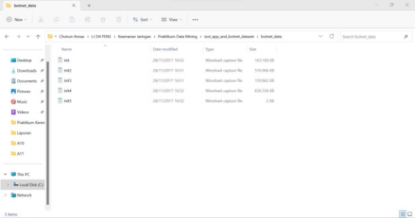

2. Kemudian buka file tersebutsecara bergantian menggunakan Wireshark. Pada langkah ini kita gunakan  

file init.pcap 

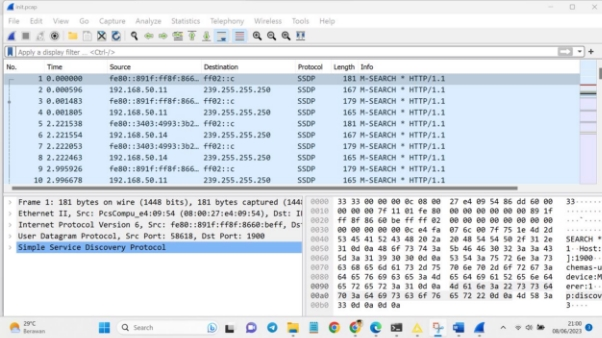

3. Untuk proses analisa yang akan dilakukan nantinya, kita akan mengambil data dengan ip versi 4 (ipv4) dan protocol TCP, DNS saja. Untuk proses tersebut  dapat  dilakukan pada wireshark menggunakan perintah ip.version==4 && tcp || dns pada kolom display filter tepat dibawah toolbar 

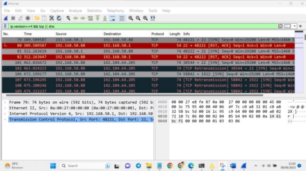

4. Untuk mendapatkan delta time dan delta time dan delta time display, klik Edit – Preferences – Column 

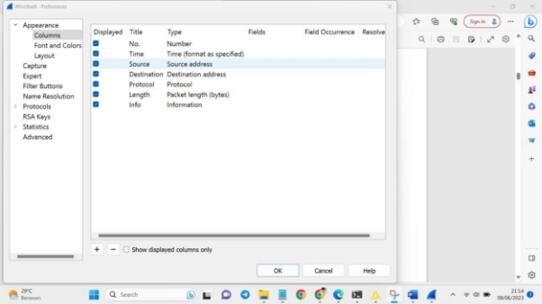

Hasilnya 

5. Export file pcap tersebut keformat Comma-separated Value (.csv) dengan cara klik File – Export Packet Dissections – As CSV. Yang perlu diperhatikan yaitu pada Pacet Range, pastikan yang terpilih yaitu Displayed, karena data pada Displayed ini sudah terfilter denga nip version 4 

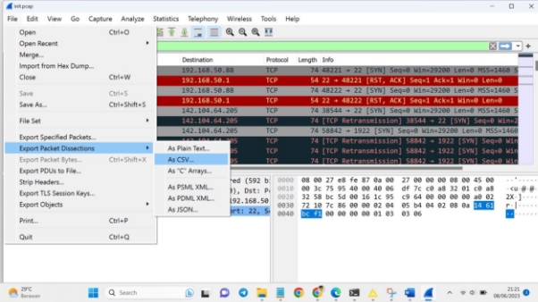

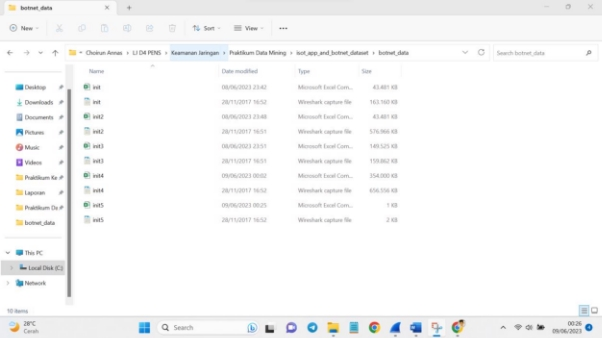

5. membuat workflow/project  baru. Dengan cara klik File – New – New Knime Workflow – Tulis Nama workflow dan Lokasi workflow tersebut – Klik Finish 

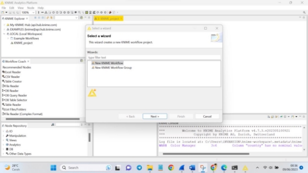

6. Tambahkan data kedalam file reader 

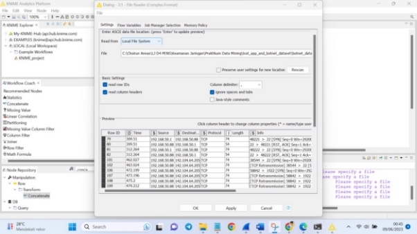

7. Gabungkan kelima data dengan menggunakan concatenate dan data reader seperti gambar dibawah 

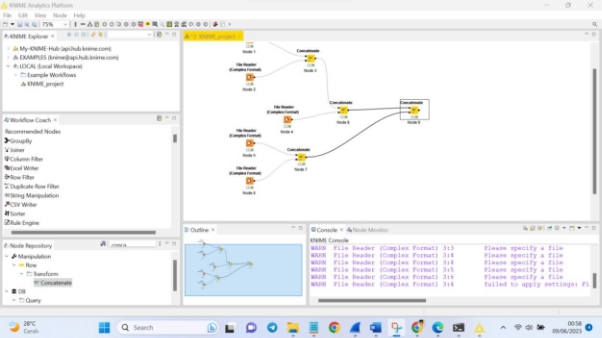

8. Untuk melakukan labeling data normal kita akan menggunakan Node Missing Value. Node ini digunakan untuk mengisi data kosong. 

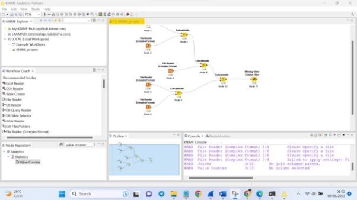

9. Untuk memastikan bahwa kolom label sudah terisi dengan value Malicious atau Normal, dapat menggunakan node Value Counter. Node ini berfungsi untuk menghitung jumlah seluruh value pada kolom terpilih. 

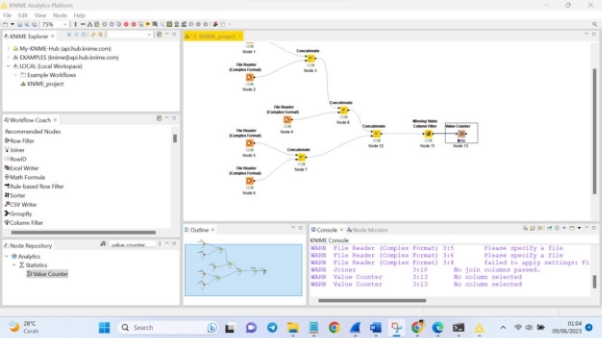

10. Export file ke dalam format .csv dengan menggunakan node CSV Writer 

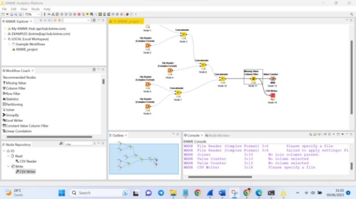

Saya menaruh data didalam file hasil.csv 

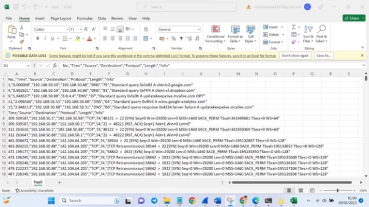

11. Data Pre Processing 

Proses dimana data akan dibersihkan (cleaning) karena biasanya didalam suatu data terdapat nilai-nilai yang tidak sempurna atau bahkan terdapat nilai-nilai yang hilang atau kosong yang nantinya akan dapat mempengaruhi proses kedepannya. Pada proses ini kita membutuhkan Node-node berikut : File Reader, Column Filter, Missing Value.

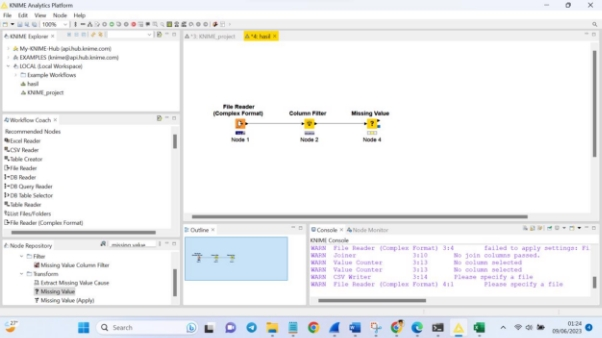

12. Proses data transformation, pada proses ini data akan diubah ke format yang sesuai untuk proses  data  mining.  Node  yang  digunakan  pada  tahap  ini  yaitu  Normalizer.  Berikut konfigurasinya 

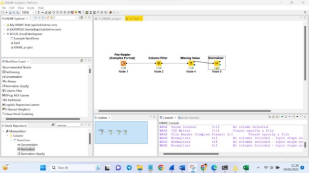

13. Data Mining  

Setelah menyelesaikan tahap data transformation, kita akan menjalankan proses Data Mining, dalam proses ini kita akan menggunakan Metode Klasifikasi Decision Tree dengan teknik Cross  Validation.  Pada  proses  ini  kita  membutuhkan  Node-node  berikut  :  X-Partitioner, Decision Tree Learner, Decision Tree Predictor, X-Aggregator Sehingga akan membentuk flow seperti ini 

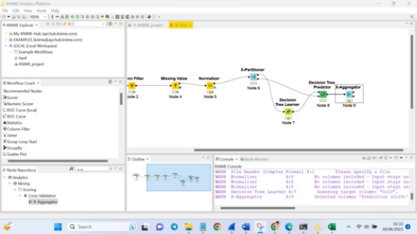

14. Node Scorer yang didalamnya terdapat perhitungan untuk melihat seberapa baik model ini dengan menggunakan teknik confusion matrix. Berikut konfigurasinya. 

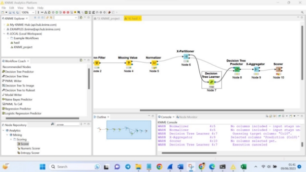

15. Hasil  Prediksi 

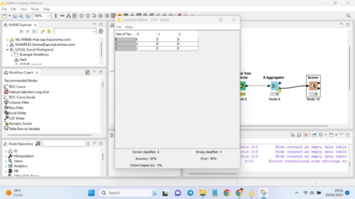
