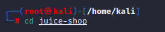

<h3 align="center">
    <b>Kemanan Jaringan</b> 
    Instalasi Juice Shop
</h3>
 

  

 

    Dosen Pembimbing: 
    Ferry Astika Saputra, S.T., M.Sc.

 

    Disusun Oleh: 
    Iqbal Darmawan (3122640041)

 

    <b>
        KELAS D4 LJ IT B  
        JURUSAN D4 LJ TEKNIK INFORMATIKA  
        DEPARTEMEN TEKNIK INFORMATIKA DAN KOMPUTER   
        POLITEKNIK ELEKTRONIKA NEGERI SURABAYA  
        2023
    </b>

 
 

1. Instalasi Juice shop di kali linux
1. Untuk melakukan instalasi juice shop pada kali linux pertama perlu menyiapkan OS kali linux yang sudah terinstal didalam virtual box

1. Lakukan instalasi node js untuk kebutuhan npm saat menjalankan juice shop dengan perintah berikut :
   *“sudo apt-get install nodejs”*

1. Lakukan instalasi npm jika belum ada pada os kali linux dengan perintah berikut :

*"sudo apt-get install npm”*

1. Lakukan instalasi git untuk clone project juice shop yang ada pada repository git dengan perintah berikut :

*"* *sudo apt-get install git”*

1. Lakukan clone project juiceshop dengan perintah berikut :

*“git clone <https://github.com/bkimminich/juice-shop.git>”*

1. Setelah clone project, masuk kedalam folder yang telah di clone dengan perintah berikut :

*“cd juice-shop”*

1. Lakukan instalasi dependecy yang dibutuhkan untuk project juice-shop dengan perintah berikut :

*“npm install”*

1. Setelah berhasil melakukan instalasi dependecy, jalankan project juice shop dengan perintah berikut :

*“npm start”*

1. Buka browser dan kunjungi URL sesuai port yang berjalan saat npm start yaitu <http://localhost:3000/>

1. hubungan antara OWASP 10 2022 dengan aplikasi Juiceshop

Juice shop adalah sebuah aplikasi web yang sengaja dibangun rentan terhadap serangan keamanan web tertentu untuk membantu pengguna mempelajar praktik keamanan web dan mengeksplorasi serangan keamanan web yang umum. Sedangkan owasp 10 adalah daftar risiko keamanan aplikasi web yang paling umum dan sering terjadi yang dipublikasikan oleh Open Web Application Security Project (OWASP). Jadi JuiceShop dan OWASP Top 10 terkait karena JuiceShop sengaja memiliki beberapa celah keamanan yang terkait dengan daftar risiko keamanan pada OWASP Top 10. Dalam hal ini, JuiceShop dapat digunakan sebagai alat belajar yang efektif untuk memahami risiko keamanan terkait dengan OWASP Top 10 dan bagaimana mengatasi risiko tersebut. Dengan mencoba mengeksplorasi celah keamanan dalam JuiceShop, pengguna dapat mempelajari cara mengidentifikasi risiko keamanan, mengevaluasi serangan potensial, dan memitigasi risiko keamanan yang terkait dengan daftar OWASP Top 10

1. 10 kerentanan yang populer di aplikasi web (OWASP 10)

1. Injection

Injection adalah kerentanan yang terjadi ketika input pengguna tidak dicegah dengan benar sehingga memungkinkan attacker untuk memasukkan kode berbahaya ke dalam aplikasi. Serangan injection dapat terjadi pada berbagai jenis aplikasi web, seperti SQL injection, LDAP injection, dan XML injection.

1. Broken Authentication and Session Management

Kerentanan ini terjadi ketika sistem otentikasi dan manajemen sesi tidak diimplementasikan dengan benar. Sebagai contoh, pengguna dapat memanipulasi cookie untuk mengakses akun pengguna lain atau menggunakan sesi yang sudah kadaluarsa.

1. Cross-Site Scripting (XSS)

XSS adalah serangan yang memungkinkan attacker memasukkan skrip berbahaya ke dalam halaman web yang dapat dieksekusi pada browser pengguna. Serangan ini dapat memungkinkan attacker untuk mencuri data pengguna atau mengubah tampilan halaman web.

1. Broken Access Control

Kerentanan ini terjadi ketika kontrol akses yang tidak diimplementasikan dengan benar, sehingga attacker dapat mengakses data yang tidak seharusnya mereka lihat. Sebagai contoh, attacker dapat mengakses data pengguna lain melalui ID atau URL yang mudah ditebak.

1. Security Misconfiguration

Kerentanan ini terjadi ketika sistem tidak dikonfigurasi dengan benar. Contohnya, pengaturan yang buruk pada web server, database, atau aplikasi dapat memungkinkan attacker untuk mengakses data sensitif atau mengeksploitasi celah keamanan yang sudah diketahui.

1. Insecure Cryptographic Storage

Kerentanan ini terjadi ketika data yang sensitif disimpan tanpa enkripsi yang memadai. Sebagai contoh, password yang disimpan dalam format yang dapat dibaca dapat memungkinkan attacker untuk mencuri data pengguna dengan mudah.

1. Insufficient Logging and Monitoring

Kerentanan ini terjadi ketika sistem tidak memadai dalam mencatat dan memantau aktivitas pengguna. Tanpa adanya pemantauan yang memadai, attacker dapat melakukan serangan dan keluar dari sistem tanpa meninggalkan jejak.

1. Insecure Communications

Kerentanan ini terjadi ketika data yang dikirimkan antara browser dan server tidak dienkripsi dengan benar. Hal ini dapat memungkinkan attacker untuk memata-matai atau memodifikasi data yang dikirimkan.

1. Using Components with Known Vulnerabilities

Kerentanan ini terjadi ketika sistem menggunakan komponen yang sudah diketahui memiliki kerentanan keamanan. Hal ini dapat memungkinkan attacker untuk mengeksploitasi celah keamanan tersebut dan mengakses data atau sistem yang sensitif.

1. Insufficient Attack Protection

Kerentanan ini terjadi ketika sistem tidak memadai dalam melindungi terhadap serangan yang diketahui. Sebagai contoh, sistem yang tidak memperbarui atau memperbaiki kerentanan yang diketahui dapat memungkinkan attacker untuk memanfaatkan celah keamanan tersebut.
