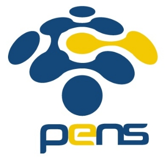

<h3 align="center">
    <b>Kemanan Jaringan</b> 
    Insecure Design
</h3>
 

  

 

    Dosen Pembimbing: 
    Ferry Astika Saputra, S.T., M.Sc.

 

    Disusun Oleh: 
    Iqbal Darmawan (3122640041)

 

    <b>
        KELAS D4 LJ IT B  
        JURUSAN D4 LJ TEKNIK INFORMATIKA  
        DEPARTEMEN TEKNIK INFORMATIKA DAN KOMPUTER   
        POLITEKNIK ELEKTRONIKA NEGERI SURABAYA  
        2023
    </b>

 
 

**A. Privacy Policy Inspection**

pada challange ini kita diperintahkan untuk melakukan inspeksi pada halaman privacy policy untuk mendapatkan informasi penting dari web OWASP Juice Shop ini.

1. Masuk kehalaman privacy policy dengan melakukan klik account pada bagian navbar lalu klik privacy & security dan selanjutnya kita klik privacy policy.

1. Selanjutnya akan muncul halaman privacy policy seperti berikut

1. Pada halaman ini ketika kita melakukan hover pada bagian alamat domain kita, muncul warna kuning dan merah seperti pada gambar ini.

1. Tidak hanya itu saja ternyata, masih ada kalimat kalimat lainnya yang ketika dihover muncul warna serperti itu, berikut ini adalah list kalimatnya
   1. [http://127.0.0.1](http://127.0.0.1/)
   1. we may also
   1. instruct you
   1. to refuse all
   1. reasonably necessary
   1. responsibility
1. Kita gabungkan semua kalimat tersebut menjadi sebuah enpoint url <http://127.0.0.1:3000/We/may/also/instruct/you/to/refuse/all/reasonably/necessary/responsibility> dan akan muncul halaman website seperti gambar berikut

dari halaman ini kita dapat melihat informasi penting seperti framework yang digunakan beserta dengan versi nya, kita juga dapat melihat directory structure nya juga. Oleh karena itu challange ini termasuk Insecure Design karena melanggar "CWE-209 Generation of Error Message Containing Sensitive Information"

