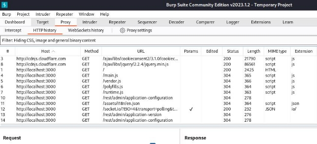
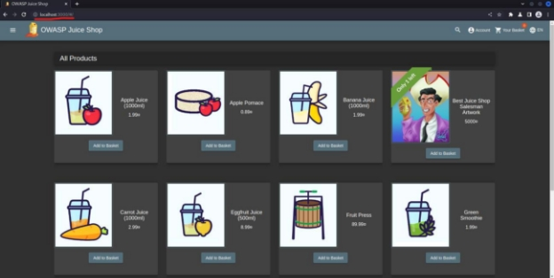
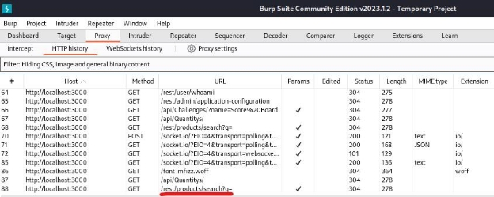
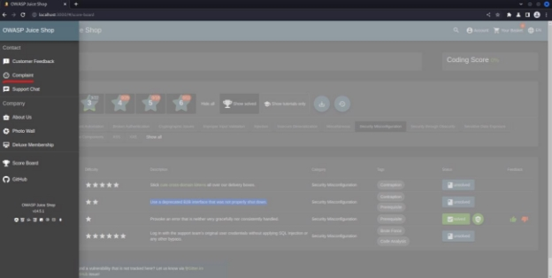
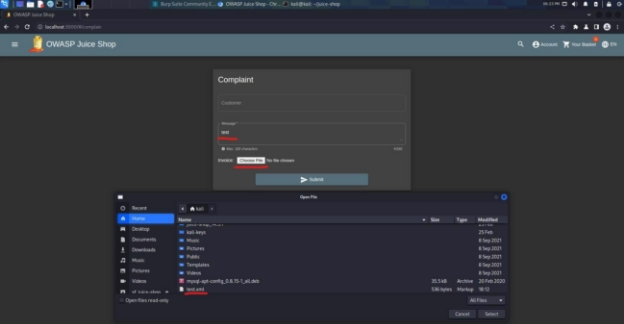
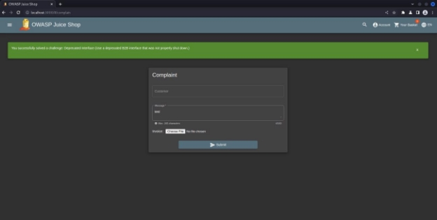
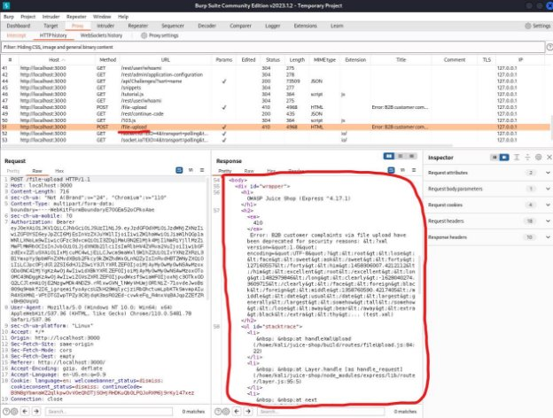

<h3 align="center">
    <b>Kemanan Jaringan</b> 
    Security Misconfiguration
</h3>
 

  

 

    Dosen Pembimbing: 
    Ferry Astika Saputra, S.T., M.Sc.

 

    Disusun Oleh: 
    Iqbal Darmawan (3122640041)

 

    <b>
        KELAS D4 LJ IT B  
        JURUSAN D4 LJ TEKNIK INFORMATIKA  
        DEPARTEMEN TEKNIK INFORMATIKA DAN KOMPUTER   
        POLITEKNIK ELEKTRONIKA NEGERI SURABAYA  
        2023
    </b>

 
 

1. **Error Handling** 

memunculkan error, tetapi error yang ditampilkan tidak secara bagus dan konsisten. 

1. Nyalakan Burp Suite terlebih dahulu 

2. Selanjutnya buka browser dan pergi ke halaman utama website OWASP Juice Shop 

3. Buka kembali Burp Suite maka akan muncul request baru yaitu /rest/product/search 

4. Masukkan payload /rest/product/search tadi ke repeater lalu ubah enpointnya menjadi text random lalu klik tombol send 

maka yang terjadi adalah response error 500 atau internal server error yang disini terlihat terdapat error message yang begitu panjangnya dan tidak tertata 

2. **Deprecated Interface** 

Menggunakan antarmuka B2B usang yang tidak dimatikan dengan benar. 

1. Pada halaman utama, klik tombol menu di pojok kiri atas untuk memunculkan sidebar. Setelah itu klik complaint 

2. Setelah sudah masuk ke halaman complaint, isikan form yang ada, dan masukkan file dengan format xml 

3. Setelah itu akan muncul challange Deprecated Interface berhasil di selesaikan seperti ini 

4. Jika kita lihat di proxy history pada burp suite, akan muncul error panjang seperti ini 

