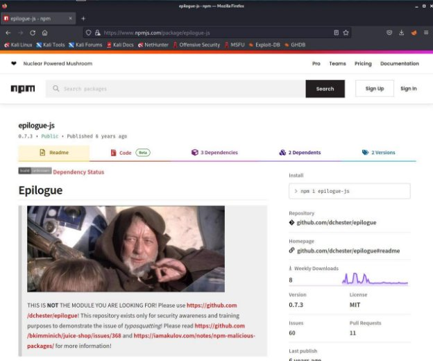

<h3 align="center">
    <b>Kemanan Jaringan</b> 
    Vulnerable Components
</h3>
 

  

 

    Dosen Pembimbing: 
    Ferry Astika Saputra, S.T., M.Sc.

 

    Disusun Oleh: 
    Iqbal Darmawan (3122640041)

 

    <b>
        KELAS D4 LJ IT B  
        JURUSAN D4 LJ TEKNIK INFORMATIKA  
        DEPARTEMEN TEKNIK INFORMATIKA DAN KOMPUTER   
        POLITEKNIK ELEKTRONIKA NEGERI SURABAYA  
        2023
    </b>

 
 

**A. Legacy Typosquatting** 

Typosquatting , juga disebut URL hijacking, sting site, atau fake URL, adalah bentuk cybersquatting , dan kemungkinan brandjacking yang bergantung pada kesalahan seperti kesalahan ketik yang dibuat oleh pengguna Internet saat memasukkan alamat situs web ke dalam browser web. Jika pengguna secara tidak sengaja memasukkan alamat situs web yang salah, mereka dapat diarahkan ke URL apa pun (termasuk situs web alternatif yang dimiliki oleh cybersquatter). Ini bisa merujuk ke goggle.com. Goggle.com adalah situs web berbahaya salah ketik yang bahkan dapat membahayakan komputer Anda dan menghapus ROM Anda dalam 30 

detik 

1. Langkah pertama kita pergi ke URL berik[ut http://localhost:3000/ft](http://localhost:3000/ftp)p 

2. Setelah itu kita akan ditunjukkan list file yang ada pada directory ftp ini seperti gambar diatas. Kita buka file yang bernama package.json.bak 

3. Setelah itu akana muncul tampilan seperti pada gambar diatas yang menampilkan error bahwa file tersebut tidak bisa dibuka. Kita ubah sedikit URL setelah pergi ke halaman package.json.bak menjadi seperti 

beriku[t http://localhost:3000/ftp/package.json.bak%2500.m](http://localhost:3000/ftp/package.json.bak%2500.md)d 

4. Setelah menjalankan URL tersebut kita akan mendownload file yang berisi package json aplikasi website tersebut 

5. Dari file package json ini kita coba check dependencies apa saja yang digunakan oleh aplikasi ini. Setelah itu kita melihat salah satu dependencies yang sepertinya tidak seharusnya atau typo dalam penulisannya tetapi dapat digunakan yaitu yang bernama epilogue-js. Ketika kita buka pada website npm muncul tampilan sebagai berikut 

6. Untuk package yang seharusnya digunakan adalah package epilogue bukan epilogue-js 

7. Kita informasikan temuan kita ini pada customer feedback untuk menyelesaikan challange ini 

