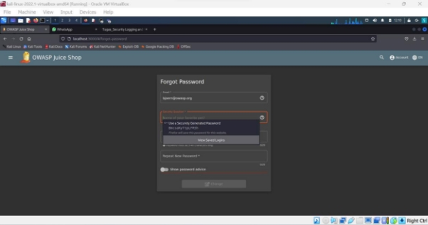

<h3 align="center">
    <b>Kemanan Jaringan</b> 
    Identification and Authentication Failures
</h3>
 

  

 

    Dosen Pembimbing: 
    Ferry Astika Saputra, S.T., M.Sc.

 

    Disusun Oleh: 
    Iqbal Darmawan (3122640041)

 

    <b>
        KELAS D4 LJ IT B  
        JURUSAN D4 LJ TEKNIK INFORMATIKA  
        DEPARTEMEN TEKNIK INFORMATIKA DAN KOMPUTER   
        POLITEKNIK ELEKTRONIKA NEGERI SURABAYA  
        2023
    </b>

 
 

**Identification and Authentication Failures**  

Dikenal sebagai Broken Authentication. Identifikasi dan autentikasi membantu framework  digital  sebagai  pertahanan  awal.  Identifikasi  melibatkan pengatribusian identitas unik  setiap  pengguna untuk  menggunakan layanan aplikasi. Autentikasi memvalidasi sesi  pengguna berdasarkan identitas yang ditetapkan dan kredensial akses. Kegagalan identifikasi dan autentikasi terjadi ketika aplikasi gagal menerapkan fungsi yang terkait dengan identitas pengguna, keaslian, dan  manajemen sesi  dengan  benar.  Kegagalan seperti  ini  sering 

menyebabkan ancaman tingkat sistem yang terus-menerus dieksploitasi oleh aktor jahat untuk mengambil identitas pengguna, pencurian data, atau kompromi seluruh sistem. 

Percobaan 

1. Mencari akun dari user Bjoern pada review salah satu produk di Juice Shop website 

2. Setelah alamat email Bjoern dicopy, pindah ke halaman login, dan klik Forgot your password pada login page karena tidak tahu apa password untuk akun ini. Kemudian  Inputkan  email  bjoern@owasp.org dan  akan  tampil  pertanyaan keamanan dari akun tersebut yaitu nama hewan favorit nya 

3. Untuk bisa menemukan nama hewan favorit Bjoern, mencoba mencari di internet dengan keyword “Bjoern’s favorite pet” dan hasil teratasnya adalah sebagai berikut. 

4. Setelah diketahui nama hewan favoritnya adalah Zaya, inputkan pada form lupa password. Ketikkan password baru sesuai keinginan dan klik change. Di sini saya menggunakan password baru: Admin123 

