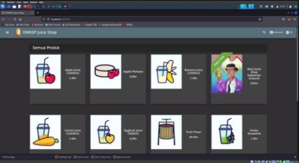
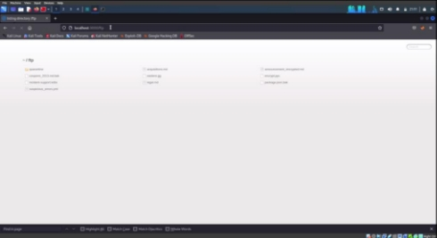
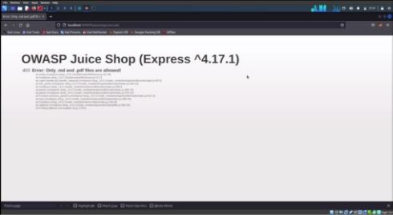
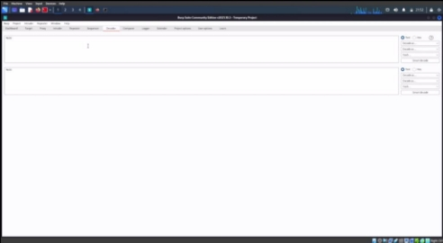
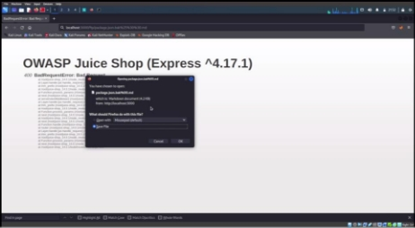
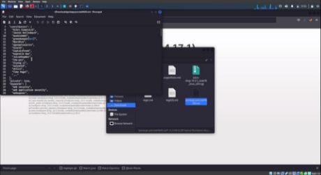

<h3 align="center">
    <b>Kemanan Jaringan</b> 
    Software and Data Integrity Failures
</h3>
 

  

 

    Dosen Pembimbing: 
    Ferry Astika Saputra, S.T., M.Sc.

 

    Disusun Oleh: 
    Iqbal Darmawan (3122640041)

 

    <b>
        KELAS D4 LJ IT B  
        JURUSAN D4 LJ TEKNIK INFORMATIKA  
        DEPARTEMEN TEKNIK INFORMATIKA DAN KOMPUTER   
        POLITEKNIK ELEKTRONIKA NEGERI SURABAYA  
        2023
    </b>

 
 

**Software and Data Integrity Failures** 

**Deskripsi** 

Software and data integrity failures dan data terkait dengan kode dan infrastruktur yang tidak melindungi  dari  pelanggaran  integritas.  Contohnya  adalah  saat  aplikasi  bergantung  pada plugin, pustaka, atau modul dari sumber, repositori, dan jaringan pengiriman konten (CDN) yang tidak tepercaya. Pipeline CI/CD yang tidak aman dapat menimbulkan potensi akses tidak sah, kode berbahaya, atau penyusupan sistem. Terakhir, banyak aplikasi sekarang menyertakan fungsionalitas pembaruan otomatis, di mana pembaruan diunduh tanpa verifikasi integritas yang  memadai  dan  diterapkan  ke  aplikasi  tepercaya  sebelumnya.  Penyerang  berpotensi mengunggah  pembaruan  mereka  sendiri  untuk  didistribusikan  dan  dijalankan  di  semua instalasi. Contoh lain adalah di mana objek atau data dikodekan atau diserialkan ke dalam struktur yang dapat dilihat dan dimodifikasi oleh penyerang yang rentan terhadap deserialisasi yang tidak aman. 

Gagalnya  Menjaga  Integritas  Data  dan  Perangkat  Lunak  disebabkan  oleh  kode  dan infrastruktur  yang  tidak  mencegah  terjadinya  pelanggaran  integritas.  Contohnya  sebuah objek/data  yang  telah  di  enkoding/diserialisasi  di  dalam  struktur  yang  dapat  dilihat  dan dimodifikasi oleh penyerang yang rentan terhadap deserialisasi yang tidak aman. 

**Percobaan** 

Pada percobaan ini akan menunjukan mengunduh kode tanpa pemeriksaan integritas. 

1. **Buka Aplikasi Juice Shop.** 

2. **Tambahkan /ftp pada link juiceshop.** 

3. **Klik package.json.bak** 

4. **Buka Burpsuite kemudian Menu Decoder, masukkan %00** 

5. **Lakukan Encode as URL** 

 

6. **Copy hasil encode pada URL package.json.bak** 

7. **Kode telah dapat diunduh**  

